# Character Relationships

> *"Every thread connects to another. Pull one, and the whole tapestry moves."*

This page maps the complex web of relationships between all characters in **The Time I Reincarnated as a Hoe**.

---

## Relationship Diagram

```mermaid
flowchart TB
    subgraph Empire["THE EMPIRE"]
        Malachai["Lord-Executor Malachai"]
        Krell["High Janissary Krell"]
        Vance["Dr. Elara Vance"]
        Malachai -->|commands| Krell
        Vance -->|created| Howen
    end

    subgraph Protagonists["PROTAGONISTS"]
        Howen["🪓 HOWEN (Persona Hoe)"]
        Cora["CORA (Wielder)"]
        Howen <-->|bound by trust| Cora
    end

    subgraph Allies["ALLIES"]
        Chitin["Chitin (Megascarab)"]
        Wheatstone["Charles Wheatstone (AI)"]
    end

    subgraph Deserters["THE DESERTERS"]
        Vex["Captain Saren Vex"]
        Rustwing["Rustwing"]
    end

    subgraph Barleybloom["BARLEYBLOOM TRIBE (DESTROYED)"]
        Elder["Elder Barleybloom †"]
    end

    %% Relationships
    Howen -->|empathy bond| Chitin
    Chitin -->|wary ally| Cora
    Krell -->|hunts| Howen
    Krell -->|hunts| Cora
    Vex -->|mentors| Cora
    Wheatstone -->|coordinates escape| Vex
    Wheatstone -->|connection from past| Howen
    Elder -->|great-uncle| Cora
    Malachai -->|burned| Barleybloom
```



### Antagonist Relationships


### Alliance Web


---

## Core Relationships

### Howen & Cora

**Bond Type**: Psychic/Emotional Partnership  
**Trust Level**: ████████████ 100%  
**Conflict Level**: █░░░░░░░░░░ 10%

The central relationship of the story. What begins as accidental discovery evolves into the deepest bond either has ever known.

**Evolution by Arc:**

| Arc | Howen's View of Cora | Cora's View of Howen |
|-----|---------------------|---------------------|
| 2 | Potential wielder, means of escape | Weird, hungry-making tool |
| 2 (late) | Person worth protecting | A PERSON in there?! |
| 3 | Partner, friend, responsibility | Partner, friend, hope |
| 4 | Family, equal, source of strength | Family, equal, guide |
| 5 | The reason to keep fighting | Everything worth fighting for |

**Key Moments:**
1. Cora first "hearing" Howen's psychic communication (Arc 2, Ch 6)
2. Howen revealing her past to Cora (Arc 3, Ch 4)
3. Their fight over whether to join the Empire (Arc 3, Ch 11)
4. Cora refusing to abandon Howen when offered safety (Arc 4, Ch 10)
5. The mutual decision to leave the rimworld together (Arc 5, Ch 12)

**Conflict Sources:**
- Howen's protectiveness can feel controlling
- Cora sometimes forgets Howen isn't physically present
- Disagreements about tactics (Howen is more ruthless)
- The existential awkwardness of their unique bond

---

### Howen & Chitin

**Bond Type**: Psychic Empathy / Surrogate Parent  
**Trust Level**: █████████░░ 85%  
**Conflict Level**: ███░░░░░░░░ 25%

An unlikely friendship between a human consciousness and a giant beetle larva.

**Evolution:**

| Stage | Relationship Status |
|-------|-------------------|
| First Meeting | Mutual curiosity, wariness |
| Befriending | Howen learns Chitin responds to emotional projection |
| Alliance | Chitin becomes protective, sees Howen as "hive" |
| Separation | Chitin falls into vault depths; presumed dead |
| Reunion | Chitin returns, grown larger, still loyal |
| Final | Chitin is fully grown, a formidable ally who can't be commanded but chooses to help |

**Key Dynamics:**
- Howen can't fully control Chitin, only communicate
- Chitin's insect logic sometimes conflicts with human plans
- The bond is genuine but alien—neither fully understands the other
- Chitin is jealous of Cora (in an insect way)

---

### Howen & Dr. Vance

**Bond Type**: Creator/Creation (Unwilling)  
**Trust Level**: ░░░░░░░░░░░ 0%  
**Conflict Level**: ██████████░ 95%

The woman who made Howen what she is. Their relationship is the central mystery of Howen's past.

**What Howen Remembers:**
- She was a farmer, living peacefully before the collapse
- The facility took her—she doesn't remember why
- Vance was there, cold and clinical
- Then... nothing until waking up as a hoe centuries later

**What Howen Wants:**
- Answers: Why her? Why a hoe? Why was a simple farmer chosen?
- Justice: For what was done to her
- Understanding: Was there a reason, or was she just convenient?

**What Vance Wants:**
- Unknown—she remains elusive
- Possibly regret, possibly continued research
- She keeps tabs on Howen but doesn't pursue directly

---

### Cora & The Empire

**Bond Type**: Hatred Born of Trauma  
**Trust Level**: ░░░░░░░░░░░ 0%  
**Conflict Level**: ██████████ 100%

The Empire destroyed Cora's family and home. This hatred drives much of her character arc.

**Evolution:**

| Arc | Cora's Stance |
|-----|--------------|
| 2 | Fear and avoidance |
| 3 | Reluctant cooperation (strategic) |
| 4 | Infiltration to find information |
| 4 (late) | Rage after discovering full truth |
| 5 | Focused opposition, working to destroy from outside |

**Complicating Factors:**
- Not all Imperial soldiers are evil individuals
- The Empire provides stability in some areas
- Cora must confront whether revenge is justice

---

### Captain Vex & Cora

**Bond Type**: Mentor/Student  
**Trust Level**: ███████░░░░ 70%  
**Conflict Level**: ██░░░░░░░░░ 20%

Vex sees her younger self in Cora—someone driven by rage who could become a monster or a hero.

**Evolution:**
- Initial: Vex is harsh, testing Cora's resolve
- Training: Vex becomes demanding but fair
- Acceptance: Vex admits Cora has potential
- Respect: Vex trusts Cora with important missions
- Partnership: By the end, they're near-equals

**Key Tension:**
Vex believes in pragmatic cruelty when necessary. Cora believes in maintaining principles. Their debates about acceptable tactics drive several key scenes.

---

### Charles Wheatstone & Howen

**Bond Type**: Creator's Witness / Guilt-Driven Protector  
**Trust Level**: ███████░░░░ 70%  
**Conflict Level**: ██░░░░░░░░░ 20%

Wheatstone is an AI from the pre-collapse era—the same facility where Howen was rip-scanned. He was there when it happened and has been searching for her ever since, driven by centuries of guilt.

**Relationship with Howen:**
- He remembers her as a human, before the rip-scan
- Carries immense guilt for not stopping it
- Wants to help her escape and find peace
- Howen is wary but recognizes his genuine remorse

**Relationship with Vex:**
- Old digital allies from earlier resistance efforts
- Mutual respect but disagreement on methods
- Vex prefers direct action; Wheatstone prefers subtlety

**Relationship with Cora:**
- Cora distrusts AIs initially
- Wheatstone proves himself through actions
- He sees protecting Howen as protecting Cora too

---

### Malachai & Krell

**Bond Type**: Commander/Instrument  
**Trust Level**: █████████░░ 90%  
**Conflict Level**: █░░░░░░░░░░ 10%

Malachai commands; Krell executes. It's a professional relationship that works because neither expects more.

**Key Dynamic:**
- Malachai provides targets and authorization
- Krell never questions orders but isn't a mindless drone
- Krell respects Malachai's strategic mind
- Malachai respects Krell's efficiency

**Tension:**
Krell is becoming obsessed with catching Howen specifically. This singular focus concerns Malachai, who needs Krell for other operations.

---

## Faction Relationships

### The Empire vs. Everyone

| Faction | Empire's View | Their View of Empire |
|---------|--------------|---------------------|
| Tribals | Savages to civilize | Destroyers, oppressors |
| Deserters | Traitors to eliminate | Corrupt tyrants |
| Traders | Useful, taxable | Necessary evil |
| Mechanoids | Neutral threat | N/A |

### The Deserters vs. Tribals

**Status**: Uneasy Alliance

- Share a common enemy
- Cultural differences create friction
- Deserters want military strategy
- Tribals want to protect their way of life
- Unity comes slowly but holds when tested

### Traders & Everyone

**Status**: Profitable Neutrality

Traders like Jax maintain careful neutrality because:
- Empire money spends as well as rebel money
- Picking sides is bad for business
- Information is more valuable than loyalty

---

## Relationship Evolution Chart

### How Trust Changes Over Time

```
Trust Level (0-10)

Howen→Cora    ╔════════════════════════════════╗
              ║  Arc2   Arc3   Arc4   Arc5     ║
              ║   5→8    8→9    9→10  10       ║
              ╚════════════════════════════════╝

Cora→Howen    ╔════════════════════════════════╗
              ║  Arc2   Arc3   Arc4   Arc5     ║
              ║   0→8    8→9    9→10  10       ║
              ╚════════════════════════════════╝

Cora→Empire   ╔════════════════════════════════╗
              ║  Arc2   Arc3   Arc4   Arc5     ║
              ║   0      2→4    4→0   0        ║
              ╚════════════════════════════════╝

Howen→Vance   ╔════════════════════════════════╗
              ║  Arc2   Arc3   Arc4   Arc5     ║
              ║   ?      ?      0→-5  -5       ║
              ╚════════════════════════════════╝
```

---

## Secret Connections

### Revealed Later in Story

1. **Wheatstone & Vance**: Were once colleagues before Vance's moral descent
2. **Malachai & Cora's Father**: Malachai personally ordered Barleyhollow's destruction
3. **The Overseer & Howen**: The Overseer's creator was Howen's mentor
4. **Krell's Scar**: Given to him by Captain Vex in a previous encounter
5. **Chitin's Intelligence**: Not random—the vault was experimenting on megascarabs

---

[← Supporting Characters](./supporting.md) | [Back to Characters](./index.md)
